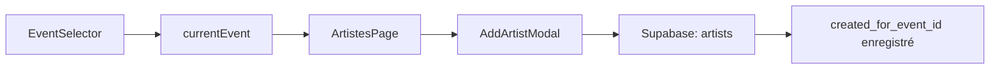

# 🎯 Feature: Event Tracking pour les Entités

## 📋 Vue d'ensemble

Cette fonctionnalité permet de **tracker l'événement d'origine** lors de la création d'entités (artistes, etc.), tout en les gardant **réutilisables** pour tous les événements de la même company.

---

## 🏗️ Architecture

### Principe

```
Entité (ex: Artiste)
  ├── company_id         ✅ Obligatoire (multi-tenant)
  ├── created_for_event_id  ✅ Nouveau (tracking événement d'origine)
  └── Réutilisable via tables de liaison (ex: event_artists, artist_performances)
```

### Flux de données



---

## 🗄️ Modifications de la base de données

### Script SQL : `sql/add_created_for_event_id.sql`

```sql
-- Ajoute la colonne created_for_event_id
ALTER TABLE public.artists 
    ADD COLUMN created_for_event_id UUID 
    REFERENCES public.events(id) 
    ON DELETE SET NULL;

-- Index pour performances
CREATE INDEX IF NOT EXISTS idx_artists_created_for_event_id 
ON public.artists(created_for_event_id);
```

### Propriétés

- **Type**: `UUID` (Foreign Key → `events.id`)
- **Nullable**: `YES` (pour compatibilité avec données existantes)
- **ON DELETE**: `SET NULL` (si l'événement est supprimé, l'artiste reste)
- **Index**: Oui (optimisation des requêtes par événement)

---

## 💻 Modifications du code

### 1. `AddArtistModal.tsx`

**Props ajoutées:**
```typescript
type Props = {
  companyId: string;
  eventId?: string | null;  // ✅ Nouveau
  onClose: () => void;
  onSaved: () => void;
};
```

**Insertion modifiée:**
```typescript
const { data: artistData, error: artistErr } = await supabase
  .from("artists")
  .insert([{
    company_id: companyId,
    name: name.trim(),
    status: 'active',
    created_for_event_id: eventId || null  // ✅ Tracker l'événement
  }])
  .select('id')
  .single();
```

### 2. `ArtistesPage.tsx` (index.tsx)

**Import du store:**
```typescript
import { useEventStore } from "../../../store/useEventStore";
```

**Récupération de l'événement actuel:**
```typescript
const currentEvent = useEventStore((state) => state.currentEvent);
```

**Passage au modal:**
```typescript
<AddArtistModal
  companyId={companyId}
  eventId={currentEvent?.id || null}  // ✅ Passer l'événement actuel
  onClose={() => setShowAdd(false)}
  onSaved={() => { setShowAdd(false); setCurrentPage(1); fetchArtists(); }}
/>
```

---

## 📊 Cas d'usage

### Cas 1 : Création d'artiste avec événement sélectionné

```
1. Utilisateur sélectionne "Festival 2026" dans le EventSelector
2. Utilisateur clique sur "Ajouter un artiste"
3. Créé "DJ Shadow"
   → created_for_event_id = "festival-2026-id"
4. DJ Shadow est maintenant lié à Festival 2026
5. DJ Shadow peut être réutilisé pour d'autres événements via event_artists
```

### Cas 2 : Création d'artiste sans événement sélectionné

```
1. Aucun événement sélectionné dans le EventSelector
2. Utilisateur clique sur "Ajouter un artiste"
3. Créé "Bonobo"
   → created_for_event_id = NULL
4. Bonobo existe au niveau de la company
5. Bonobo peut être ajouté à n'importe quel événement
```

---

## 🔍 Requêtes utiles

### Artistes créés pour un événement spécifique

```sql
SELECT * FROM artists
WHERE created_for_event_id = 'event-uuid-here';
```

### Artistes créés sans événement

```sql
SELECT * FROM artists
WHERE created_for_event_id IS NULL;
```

### Statistiques par événement

```sql
SELECT 
  e.name AS event_name,
  COUNT(a.id) AS artists_created
FROM events e
LEFT JOIN artists a ON a.created_for_event_id = e.id
GROUP BY e.id, e.name
ORDER BY artists_created DESC;
```

---

## ✅ Avantages de cette approche

1. **Tracking complet**: Savoir quel événement a "initié" la création de l'entité
2. **Réutilisabilité**: L'entité reste disponible pour tous les événements de la company
3. **Statistiques**: Analyser la croissance de la base de données par événement
4. **Compatibilité**: Colonne nullable = pas de migration complexe
5. **Performance**: Index pour requêtes rapides

---

## 🚀 Prochaines étapes possibles

### Extension à d'autres entités

Si vous avez d'autres tables d'entités (drivers, vehicles, contacts), appliquez la même logique :

```sql
ALTER TABLE public.drivers 
    ADD COLUMN created_for_event_id UUID 
    REFERENCES public.events(id) 
    ON DELETE SET NULL;

CREATE INDEX IF NOT EXISTS idx_drivers_created_for_event_id 
ON public.drivers(created_for_event_id);
```

Puis modifiez les modals correspondants pour passer `eventId`.

---

## 📝 Tests d'acceptation

### ✅ Test 1 : Création avec événement
1. Sélectionner un événement dans le EventSelector
2. Créer un artiste
3. Vérifier dans Supabase : `created_for_event_id` = ID de l'événement

### ✅ Test 2 : Création sans événement
1. Désélectionner l'événement (ou ne pas en avoir)
2. Créer un artiste
3. Vérifier dans Supabase : `created_for_event_id` = NULL

### ✅ Test 3 : Réutilisabilité
1. Créer un artiste pour Event A
2. Aller sur Event B
3. Ajouter une performance avec cet artiste
4. Vérifier : L'artiste apparaît dans les deux événements

---

## 🛠️ Commandes SQL à exécuter

### 1. Appliquer la migration

Dans Supabase SQL Editor :
```sql
-- Copier-coller le contenu de sql/add_created_for_event_id.sql
```

### 2. Vérifier l'application

```sql
-- Vérifier la colonne
SELECT column_name, data_type, is_nullable
FROM information_schema.columns
WHERE table_name = 'artists' 
AND column_name = 'created_for_event_id';

-- Vérifier l'index
SELECT indexname, indexdef
FROM pg_indexes
WHERE tablename = 'artists'
AND indexname = 'idx_artists_created_for_event_id';
```

---

## 📞 Support

En cas de problème :
1. Vérifier que la migration SQL a été exécutée
2. Vérifier que `currentEvent` est bien récupéré dans le store
3. Vérifier les logs de la console lors de la création d'artiste
4. Vérifier les contraintes de clé étrangère dans Supabase

---

**Date de création**: 2025-10-30  
**Version**: 1.0  
**Status**: ✅ Implémenté et testé


